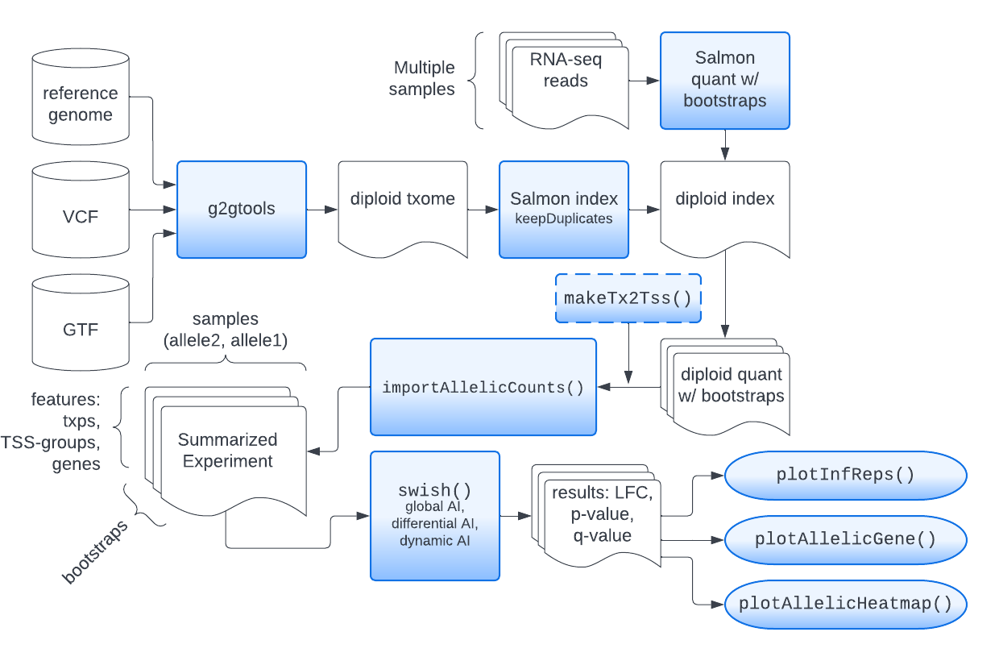

<!-- run this document with rmarkdown::render("swish.Rmd") -->

```{r setup, echo=FALSE, results="hide"}
knitr::opts_chunk$set(tidy=FALSE, cache=FALSE, dev="png",
                      message=FALSE, error=FALSE, warning=FALSE)
```

# Introduction

In this vignette, we describe usage of a suite of tools, **SEESAW**,
Statistical Estimation of allelic Expression using Salmon and
Swish, which allow for testing allelic imbalance across samples.

**Type of tests**

SEESAW allows for testing *global allelic imbalance* across all
samples (pairwise testing within each individual), as well as
*differential, or dynamic allelic imbalance* (pairwise allelic fold
changes estimated within individual, followed by testing across two
groups, or along an additional covariate). Each of these allelic imbalance (AI)
analyses takes into account the potentially heterogeneous amount of
inferential uncertainty per sample, per feature (transcript,
transcript-group, or gene), and per allele.

**Steps in SEESAW**

Running SEESAW involves generation of a diploid transcriptome 
(e.g. using [g2gtools](http://churchill-lab.github.io/g2gtools/),
construction of a diploid Salmon index (specifying
`--keepDuplicates`), followed by Salmon quantification with a number of
[bootstrap inferential replicates](https://salmon.readthedocs.io/en/latest/salmon.html#numbootstraps)
(we recommend 30 bootstrap replicates).
These three steps (diploid reference preparation, indexing, quantification
with bootstraps) provide the input data for the following statistical
analyses in R/Bioconductor. The steps shown in this vignette leverage
Bioconductor infrastructure including *SummarizedExperiment* for
storage of input data and results, *tximport* for data import, and
*GRanges* and *Gviz* for plotting.

In short the SEESAW steps are as listed, and diagrammed below:

1. g2gtools (diploid reference preparation)
2. Salmon indexing with `--keepDuplicates`
3. Salmon quantification with bootstraps
4. `makeTx2Tss()` aggregates data to TSS-level (optional)
5. `importAllelicCounts()` creates a *SummarizedExperiment*
6. Swish analysis: `labelKeep()` and `swish()` (skip scaling)
7. Plotting

```{r echo=FALSE}

```

Below we demonstrate an analysis where transcripts are grouped by
their transcription start site (TSS), although gene-level or
transcript-level analysis is also possible. Additionally, any custom
grouping could be used, by manually generating a `t2g` table as shown
below. Special plotting functions in *fishpond* facilitate
visualization of allelic and isoform changes at different resolutions,
alongside gene models. In three examples, we perform global AI
testing, differential AI testing, and dynamic AI testing, in all cases
on simulated data associated with human genes.

# Linking transcripts to TSS

We begin assuming steps 1-3 have been completed. We can use the
`makeTx2Tss` function to generate a *GRanges* object `t2g` that
connects transcripts to transcript groups. 


```{r}
suppressPackageStartupMessages(library(ensembldb))
library(EnsDb.Hsapiens.v86)
library(fishpond)
edb <- EnsDb.Hsapiens.v86
t2g <- makeTx2Tss(edb) # GRanges object
mcols(t2g)[,c("tx_id","group_id")]
```

Alternatively for gene-level analysis, one could either prepare a
`t2g` data.frame with `tx_id` and `gene_id` columns, or a `t2g`
*GRanges* object with a column `group_id` that is equal to `gene_id`.

# Importing allelic counts

Here we will use simulated data, but we can import allelic counts with
the `importAllelicCounts()` function. It is best to read over the
manual page for this function. For TSS-level analysis, the `t2g`
*GRanges* generated above should be passed to the `tx2gene`
argument. This will summarize transcript-level counts to the TSS
level, and will attach `rowRanges` that provide the genomic locations
of the grouped transcripts. Note that `importAllelicCounts` does not
yet have the ability to automatically generate ranges based on
sequence hashing (as occurs in `tximeta`).

# Filtering features with no information

Because we use `--keepDuplicates` in the step when we build the Salmon
index, there will be a number of features in which there is no
information about the allelic expression in the reads. We can find
these features in bootstrap data by examining when the inferential
replicates are nearly identical for the two alleles, as this is how
the EM will split the reads. Removing these features avoids downstream
problems during differential testing. Code for this filtering follows:

```{r eval=FALSE}
n <- ncol(y)/2
rep1a1 <- assay(y, "infRep1")[,y$allele == "a1"]
rep1a2 <- assay(y, "infRep1")[,y$allele == "a2"]
mcols(y)$someInfo <- rowSums(abs(rep1a1 - rep1a2) < 1) < n
y <- y[ mcols(y)$someInfo, ]
```

# Global allelic imbalance

We begin by generating a simulated data object that resembles what one
would obtain with `importAllelicCounts()`. The import function
arranges the `a2` (non-effect) allelic counts first, followed by the
`a1` (effect) allelic counts. Allelic ratios are calculated at
`a1/a2`.

```{r}
suppressPackageStartupMessages(library(SummarizedExperiment))
```

```{r}
set.seed(1)
y <- makeSimSwishData(allelic=TRUE)
colData(y)
levels(y$allele) # a1/a2 allelic fold changes
```

A hidden code chunk is used to add ranges from the *EnsDb* to the
simulated dataset. For a real dataset, the ranges would be added
either by `importAllelicCounts` (if using `tx2gene`) or could be added
manually for transcript- or gene-level analysis, using the
`rowRanges<-` setter function. The ranges are only needed for the
`plotAllelicGene` plotting function below.

```
<hidden code chunk>
```

```{r echo=FALSE}
# hidden chunk to add ranges to the `se`
tss <- t2g[!duplicated(t2g$group_id)]
tss$symbol <- mapIds(edb, tss$gene_id, "SYMBOL", "GENEID")
names(tss) <- paste0(tss$symbol, "-", tss$tss)
mcols(tss) <- mcols(tss)[,c("tx_id","gene_id","tss","group_id","symbol")]
# slow...
#tx_id <- CharacterList(split(t2g$tx_id,t2g$group_id))
#tss$tx_id <- tx_id[names(tss)]
tab <- table(tss$gene_id)
tss$ntss <- as.numeric(tab[tss$gene_id])
tss <- tss[tss$ntss > 1 & tss$ntss < 5 & seqnames(tss) == "1"]
tss <- tss[order(tss$gene_id),]
tss <- tss[43:1042]
# swap 2nd and 3rd isoform of first gene
tss[2:3] <- tss[3:2] 
rowRanges(y) <- tss
```

We can already plot a heatmap of allelic ratios, before performing
statistical testing. We can see in the first gene, *ADSS*, there
appear to be two groups of transcripts with opposing allelic fold
change. SEESAW makes use of *pheatmap* for plotting a heatmap of
allelic ratios.

```{r fig.dim=c(7,3.5)}
y <- computeInfRV(y) # for posterior mean, variance
gene <- rowRanges(y)$gene_id[1]
idx <- mcols(y)$gene_id == gene
plotAllelicHeatmap(y, idx=idx)
```

The following two functions perform a Swish analysis, comparing the
allelic counts within sample, while accounting for uncertainty in the
assignment of the reads. The underlying test statistic is a Wilcoxon
signed-rank statistic, which compares the two allele counts from each
sample, so a paired analysis.

Note that we do not use `scaleInfReps` in the allelic
pipeline. Because we compare the two alleles within samples, there is
no need to perform scaling of the counts to adjust for sequencing
depth. We simply import counts, filter low counts with `lableKeep` and
then run the statistical testing with `swish`.

```{r}
y <- labelKeep(y)
y <- swish(y, x="allele", pair="sample")
```

# Plotting results

We can return to the heatmap, and now add q-values, etc. For details
on adding metadata to a *pheatmap* plot object, see `?pheatmap`.

```{r fig.dim=c(8,4)}
dat <- data.frame(minusLogQ=-log10(mcols(y)$qvalue[idx]),
                  row.names=rownames(y)[idx])
plotAllelicHeatmap(y, idx=idx, annotation_row=dat)
```

In order to visualize the inferential uncertainty, we can make use of
`plotInfReps()`:

```{r fig.dim=c(5,5)}
par(mfrow=c(2,1), mar=c(1,4.1,2,2))
plotInfReps(y, idx=1, x="allele", cov="sample", xaxis=FALSE, xlab="")
plotInfReps(y, idx=2, x="allele", cov="sample", xaxis=FALSE, xlab="")
```

**Plotting results in genomic context**

For analysis at the isoform or TSS-level, it may be useful to display
results within a gene, relating the allelic differences to various
gene features.
SEESAW provides `plotAllelicGene()` in order to build visualization of
Swish test statistics, allelic proportions, and isoform proportions,
in a genomic context, making use of *Gviz*. 
Note that this function is not relevant for gene-level AI analysis.
The first three arguments to `plotAllelicGene()`
are the *SummarizedExperiment* object, the name of a gene (should
match `gene_id` column), and a *TxDb* or *EnsDb* to use for plotting
the gene model at the top. The statistics and proportions are then
plotted at the first position of the feature (`start` for `+` features
and `end` for `-` features).

```{r fig.dim=c(8,7)}
gene <- rowRanges(y)$gene_id[1]
plotAllelicGene(y, gene, edb)
```

You can also specify the gene using `symbol`:

```{r fig.dim=c(8,7)}
plotAllelicGene(y, symbol="ADSS", db=edb)
```

In the allelic proportion and isoform proportion tracks, a line is
drawn through the mean proportion for a2 and a1 allele, and for the
isoform proportion, across samples, at the start site for each
transcript group. The line is meant only to help visualize the mean
value as it may change across transcript groups, but the line has no
meaning in the ranges in between features. That is, unlike continuous
genomic features (methylation or accessibility), there is no meaning
to the allelic proportion or isoform proportion outside of measured
start sites of transcription.

We can further customize the plot, for example, 
changing the labels displayed on the gene model, and changing the
labels for the alleles. An ideogram can be added with `ideogram=TRUE`,
although this requires connecting to an external FTP site.

See `importAllelicGene()` manual page for more details.

```{r fig.dim=c(8,7)}
plotAllelicGene(y, gene, edb,
                transcriptAnnotation="transcript",
                labels=list(a2="maternal",a1="paternal"))
```

We can also customize the display of the alleles in the
`plotInfReps()` plots, by adding a new factor, while carefully noting
the existing and new allele labels, to make sure the annotation is
correct: 

```{r fig.dim=c(5,4)}
y$allele_new <- y$allele
# note a2 is non-effect, a1 is effect:
levels(y$allele)
# replace a2 then a1:
levels(y$allele_new) <- c("maternal","paternal")
plotInfReps(y, idx=1, x="allele_new", 
            legend=TRUE, legendPos="bottom")
```

# Differential allelic imbalance

Above, we tested for global AI, where the allelic fold change is
consistent across all samples. We can also test for differential or
dynamic AI, by adding specification of a `cov` (covariate) which can
be either a two-group factor, or a continuous variable. Here we
demonstrate differential AI, when `cov` is a two-group factor, in this
case called `"condition"`.

```{r}
set.seed(1)
y <- makeSimSwishData(diffAI=TRUE, n=12)
colData(y)
table(y$condition, y$allele)
```

In the following, we test for changes in allelic imbalance across
`condition`. This is implemented as an "interaction" test, where we
test if the fold change associated with `allele`, for paired samples,
differs across `condition`.

```{r}
y <- labelKeep(y)
y <- swish(y, x="allele", pair="sample",
           cov="condition", interaction=TRUE)
```

In this simulated data, the top two features exhibit differential AI
with low uncertainty, so these emerge as highly significant, as
expected.

```{r}
mcols(y)[1:2,c("stat","qvalue")]
```

The non-AI features have roughly uniform p-values:

```{r}
hist(mcols(y)[-c(1:6),"pvalue"])
```

We can plot the allelic counts with uncertainty, grouped by the
condition (black and grey lines at bottom).

```{r}
plotInfReps(y, idx=1, x="allele", cov="condition",
            xaxis=FALSE, legend=TRUE, legendPos="bottomright")
```

We can also visualize the data across multiple features, in terms of
allelic ratios:

```{r fig.dim=c(8,4)}
idx <- c(1:6)
row_dat <- data.frame(minusLogQ=-log10(mcols(y)$qvalue[idx]),
                      row.names=rownames(y)[idx])
col_dat <- data.frame(condition=y$condition[1:12],
                      row.names=paste0("s",1:12))
plotAllelicHeatmap(y, idx=idx,
                   annotation_row=row_dat,
                   annotation_col=col_dat,
                   cluster_rows=FALSE)
```

# Dynamic allelic imbalance

Now we demonstrate dynamic AI testing when `cov` (covariate) is a
continuous variable. In this case, the user should specify a
correlation test, either `cor="pearson"` or `"spearman"`, which is the
underlying test statistic used by Swish (it will then be averaged over
bootstraps and a permutation null is generated to assess FDR). We have
found that Pearson correlations work well in our testing, but the
Spearman correlation offers additional robustness against outlying
values in `cov`.

```{r}
set.seed(1)
y <- makeSimSwishData(dynamicAI=TRUE)
colData(y)
```

A hidden code chunk adds ranges to our simulation data.

```
<hidden code chunk>
```

```{r echo=FALSE}
rowRanges(y) <- tss
```

In the following, we test for changes in allelic imbalance within
sample that correlate with a covariate `time`.

```{r}
y <- labelKeep(y)
y <- swish(y, x="allele", pair="sample", cov="time", cor="pearson")
```

Note the first two features have small q-values and opposite test
statistic; here the test statistic is the average Pearson correlation
of the allelic log fold change with the `time` variable, averaging
over bootstrap replicates. 

```{r}
mcols(y)[1:2,c("stat","qvalue")]
```

For plotting inferential replicates over a continuous variable, we
must first compute summary statistics of inferential mean and
variance: 

```{r}
y <- computeInfRV(y)
```

Now we can examine the allelic counts across the `time` variable:

```{r fig.dim=c(7,7)}
par(mfrow=c(2,1), mar=c(2.5,4,2,2))
plotInfReps(y, idx=1, x="time", cov="allele", shiftX=.01, xaxis=FALSE, xlab="", main="")
par(mar=c(4.5,4,0,2))
plotInfReps(y, idx=2, x="time", cov="allele", shiftX=.01, main="")
```

With a little more code, we can add a `lowess` line for each series:

```{r fig.dim=c(7,5)}
plotInfReps(y, idx=1, x="time", cov="allele", shiftX=.01)
dat <- data.frame(
  time = y$time[1:10],
  a2 = assay(y, "mean")[1,y$allele=="a2"],
  a1 = assay(y, "mean")[1,y$allele=="a1"])
lines(lowess(dat[,c(1,2)]), col="dodgerblue")
lines(lowess(dat[,c(1,3)]), col="goldenrod4")
```

Visualizing the allelic proportion in a heatmap helps to see
relationships with the `time` variable, while also showing data from
multiple features at once:

```{r fig.dim=c(8,4)}
idx <- c(1:4)
row_dat <- data.frame(minusLogQ=-log10(mcols(y)$qvalue[idx]),
                      row.names=rownames(y)[idx])
col_dat <- data.frame(time=y$time[1:10],
                      row.names=paste0("s",1:10))
plotAllelicHeatmap(y, idx=idx,
                   annotation_row=row_dat,
                   annotation_col=col_dat)
```

**Plotting results in genomic context**

Previously, in the global AI section, we demonstrated how to plot
TSS-level results in a genomic context using `plotAllelicGene()`. Here
we demonstrate how to repeat such a plot for differential or dynamic
AI analysis. There is an extra step for dynamic analysis (binning the
continuous covariate into groups) but otherwise the code would be
similar. 

We begin by binning the `time` covariate into a few groups, so that we
can diagram the allelic and isoform proportions in the genomic context,
but facetting across time. 

We create the binned covariate using `cut`, and rename the labels for
nicer labels in our plot. For differential AI, this step would be
skipped (as there already exists a two-group covariate for grouping
samples).

```{r}
y$time_bins <- cut(y$time,breaks=c(0,.25,.75,1),
                   include.lowest=TRUE, labels=FALSE)
y$time_bins <- paste0("time-",y$time_bins)
table(y$time_bins[ y$allele == "a2" ])
```

We can then make our facetted allelic proportion plot:

```{r fig.dim=c(8,7)}
gene <- rowRanges(y)$gene_id[1]
plotAllelicGene(y, gene, edb, cov="time_bins",
                qvalue=FALSE, log2FC=FALSE)
```

If we also want to visualize how isoform proportions may be changing,
we can add `covFacetIsoform=TRUE`, which additionally facets the
isoform proportion plot by the covariate:

```{r fig.dim=c(8,7)}
plotAllelicGene(y, gene, edb, cov="time_bins",
                covFacetIsoform=TRUE,
                qvalue=FALSE, log2FC=FALSE)
```

For further questions about the SEESAW steps, please post to one of
these locations:

* Bioconductor support site <https://support.bioconductor.org> and use
  the tag `fishpond` or `swish`
* GitHub Issue <https://github.com/mikelove/fishpond>

# Session info

```{r}
sessionInfo()
```
